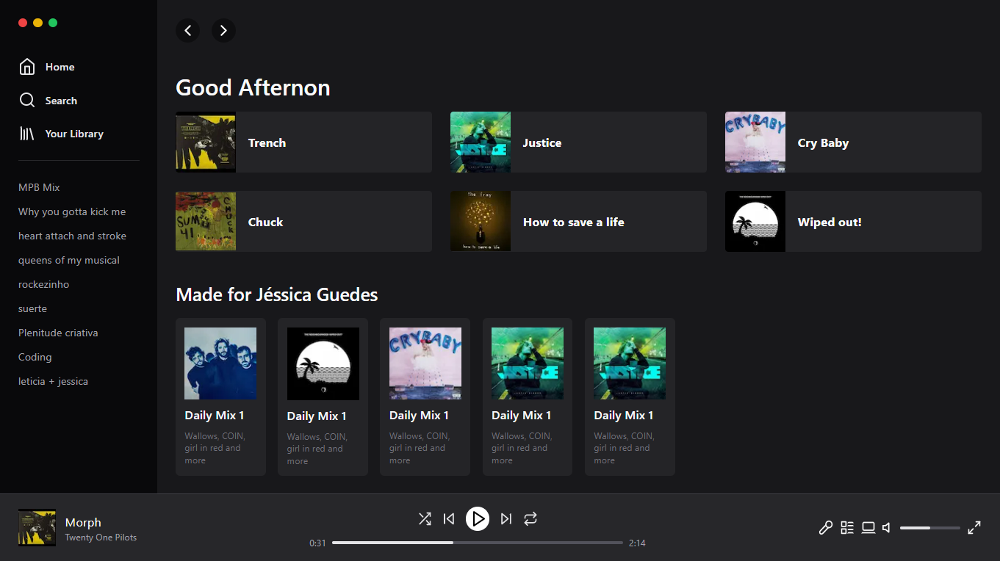

# UI Clone Spotify

Estudo sobre tailwind, recriando a interface do Spotify Web.

  

## 🚀 Tecnologias

Esse projeto foi desenvolvido com as seguintes tecnologias:

- [React](https://pt-br.reactjs.org/)
- [TypeScript](https://www.typescriptlang.org/)
- [NextJs](https://nextjs.org/)
- [TailwindCSS](https://tailwindcss.com/docs/installation)
- [Lucide](https://lucide.dev/)
